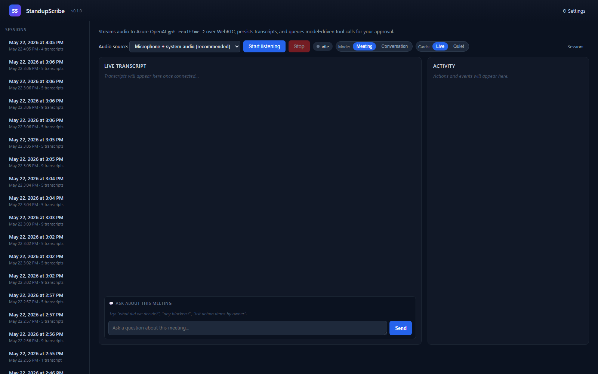
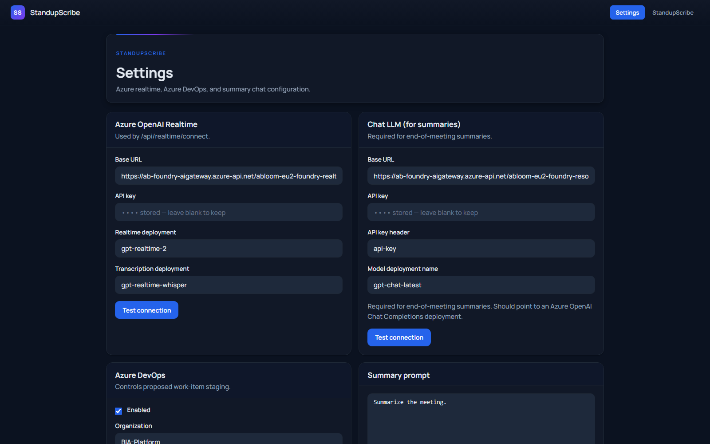

# StandupScribe

StandupScribe is an Electron desktop app that listens to engineering standups and suggests Azure DevOps updates for review before anything changes.

## Screenshots

**Listening workspace**



**Settings**



## What it does

- Captures microphone and system audio during status meetings
- Streams live transcription with Azure OpenAI Realtime
- Builds a meeting summary and Q&A context as the meeting progresses
- Proposes Azure DevOps follow-up actions instead of writing directly by default
- Keeps transcripts, settings, and pending actions on the local machine

## How it works

StandupScribe runs a realtime listener in the Electron app, feeds transcript context to a background planner, routes Azure DevOps tool access through a local MCP bridge, and stages proposed actions in the activity queue for review.

## Quick start

```powershell
git clone <repo-url>
cd StandupScribe
cd src
npm install
npm start
```

From the repository root, you can also use:

```powershell
.\Run-StandupScribe.ps1
```

## Configuration

Settings can be saved in the UI. Environment values may also be loaded from `src\.env`, `src\.env.local`, `src\local-data\.env`, or `src\local-data\.env.local`.

### Azure OpenAI Realtime

Configure in **Settings -> Azure OpenAI Realtime**:

- Base URL -> `AZURE_OPENAI_BASE_URL`
- API key -> `AZURE_OPENAI_API_KEY`
- Realtime deployment -> `AZURE_OPENAI_DEPLOYMENT_NAME`
- Transcription deployment -> `AZURE_OPENAI_TRANSCRIPTION_DEPLOYMENT_NAME`
- Optional Azure AD auth instead of API key -> `AZURE_TENANT_ID`, `AZURE_CLIENT_ID`, `AZURE_CLIENT_SECRET`

### Chat LLM

Configure in **Settings -> Chat LLM (for summaries)**:

- Base URL -> `STANDUPSCRIBE_LLM_BASE_URL`
- API key -> `STANDUPSCRIBE_LLM_API_KEY`
- API key header -> `STANDUPSCRIBE_LLM_API_KEY_HEADER`
- Model deployment name -> `STANDUPSCRIBE_LLM_MODEL`

### Azure DevOps

Configure in **Settings -> Azure DevOps**:

- Enable or disable the bridge
- Organization and project
- Tenant ID
- Read-only vs. read-write mode
- Confirm-each-action vs. auto-apply approval mode

Azure DevOps settings are managed in the app and authenticated through a dedicated Azure CLI profile. There are no public Azure DevOps env vars to seed these fields today.

## Security notes

Please read [SECURITY.md](SECURITY.md) before using the app with production credentials or enabling read-write Azure DevOps access.

## Status

**v0.1.0** - early prototype. Expect bugs, rough edges, and workflow changes. Please report issues.

## What this is / isn't

**This is** a listening assistant for engineering status meetings that are anchored in Azure DevOps. It works best when:

- The same team holds the same recurring meeting against the same backlog
- The active items in that backlog stay roughly stable week-to-week
- Speakers say things like "I'll close that data profiling work" or "add a comment that we're deferring this" — referring to real tickets by topic
- You're willing to review proposals before applying

**This isn't** ready for:

- Ad-hoc meetings spanning multiple projects
- Calls where ADO isn't the source of truth for work
- Calls dominated by side-chatter (false positives will appear)
- A replacement for a human PM/scrum master — it's a notetaker, not a decision-maker

## Recommended first-run flow for a real standup

1. **Test alone first.** Run a 1-minute solo monologue ("I'm closing X, I need to add a comment to Y, can you reassign Z to Sam") with `ado.mode = read-only`. Watch what the planner proposes. Get comfortable.
2. **Pick "Quiet" mode** before going into a live meeting. Cards queue up silently; you review them after Stop.
3. **Keep `ado.mode = read-only`** for your first 2-3 meetings. Use it as a high-quality notetaker. Flip to read-write once you trust the proposals.
4. **Use the post-meeting chat box** to ask things like "list all action items by owner" or "did we discuss the deploy bug?" The chat sees the full transcript and all proposed actions.

## Known limitations

- **30 work items pre-loaded.** If your active backlog is bigger, the planner only has the first 30 in context. It will search ADO for ones it doesn't see, but matching is keyword-based and can pick the wrong item with generic titles. *Always glance at the work-item title on the card before clicking Apply.*
- **Pure-pronoun chains can break.** If speakers say "that one" with no earlier title anchor in the call, the planner may return "noop." In normal standups this is rare.
- **No speaker labels yet.** Transcripts blend all voices. Mic-vs-others tagging is planned.
- **Off-topic chatter may produce false positives.** "I'll grab the sandwiches" can be misinterpreted. Use Quiet mode and dismiss anything wrong at the end.
- **Apply does the ADO call; Revert only flags it locally.** If you Apply and then Revert, the ADO change isn't undone automatically — open the work item link on the card and revert manually.
- **First launch SmartScreen warning.** The installer isn't code-signed by a Microsoft Authenticode CA. Right-click → Properties → Unblock, or "More info" → "Run anyway."

## License

Released under the [MIT License](LICENSE).

## Acknowledgments

Built with [Azure OpenAI Realtime](https://learn.microsoft.com/azure/ai-services/openai/), the Azure DevOps MCP server, and [Electron](https://www.electronjs.org/).